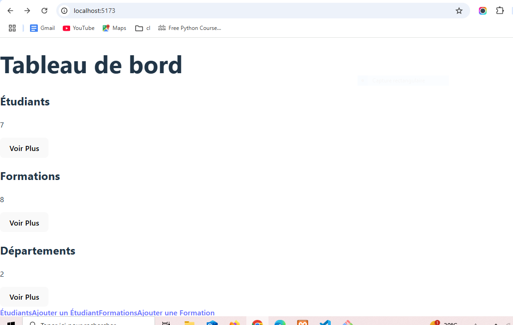
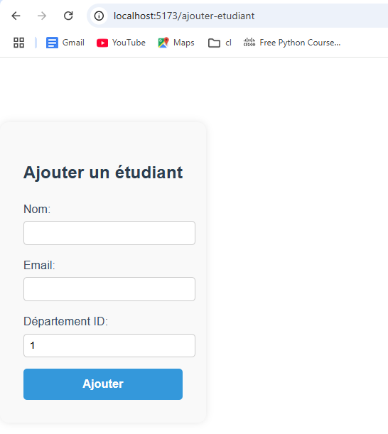
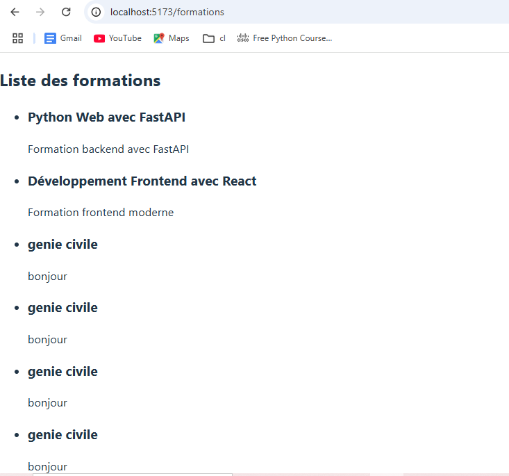
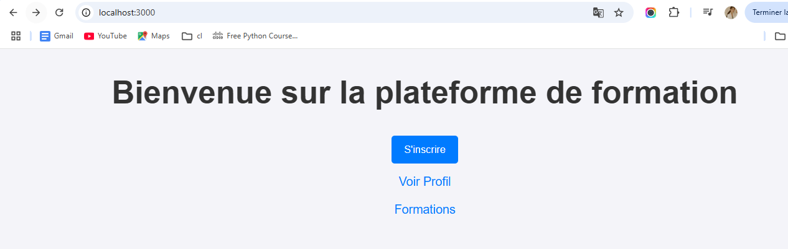
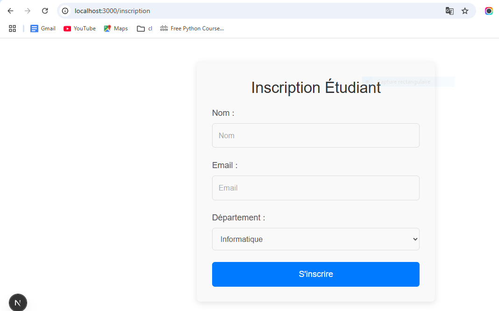
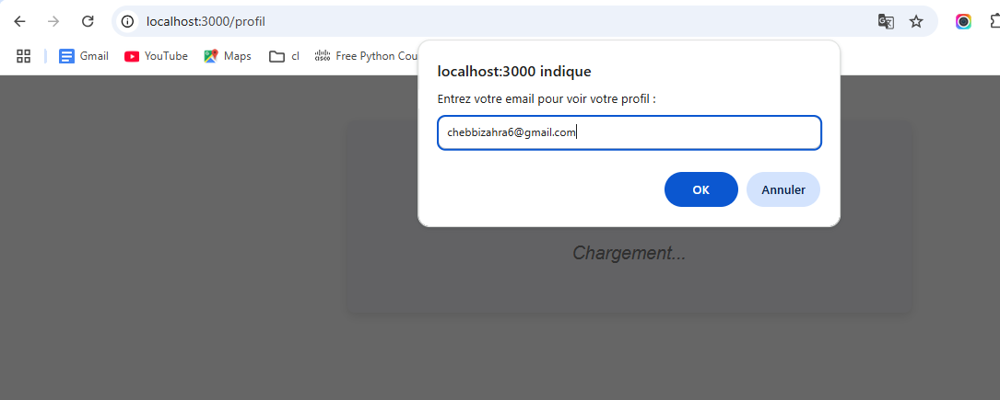
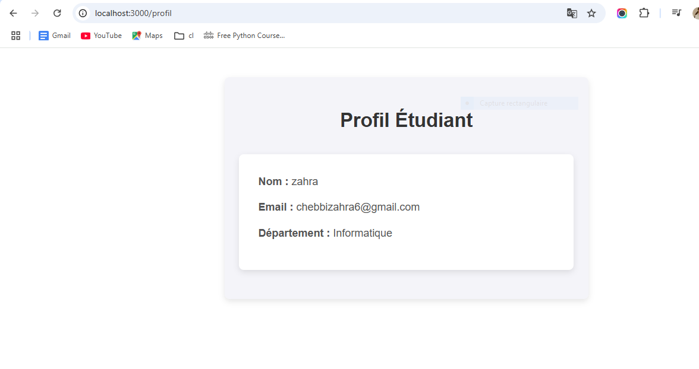

# 🎓 Gestion Étudiants - Projet Fullstack

Ce projet est une application web de gestion des étudiants, composée de trois parties : une interface d'administration (React), une interface pour les étudiants (Next.js), et un backend API (FastAPI + MySQL).

---

## 🔍 Aperçu du projet
### Dashboard statistique (Admin)


### 👩‍🏫 Formulaire d’ajout d'étudiant

### 👩‍🏫 Formulaire d’ajout de formations


### 🎓 Liste des formations(Admin)



### page d'acceuil (Etudiant)


### page d'inscription(Etudiant)


### page de profile(Etudiant)



### 🎓 Liste des formations(Etudiant)

---

## 🔧 Technologies utilisées

- **Frontend Admin** : React 17 + Vite
- **Frontend Étudiant** : Next.js 14
- **Backend** : FastAPI (Python 3.11)
- **Base de données** : MySQL
- **ORM** : SQLAlchemy
- **API Doc** : Swagger UI (automatique via FastAPI)

---

## 📂 Arborescence

```
projet/
├── admin-front/        # Admin - React
├── etudiant/     # Etudiants - Next.js
└── backend/               # API - FastAPI
```

---

## 🚀 Installation du projet

### 🫠 Backend (FastAPI)
```bash
cd backend
python -m venv env
source env/bin/activate  # ou .\env\Scripts\activate sur Windows
pip install -r requirements.txt
uvicorn main:app --reload
```

### 💻 Frontend Admin (React)
```bash
cd frontend-admin
npm install
npm run dev
```

### 👨‍🏫 Frontend Etudiant (Next.js)
```bash
cd frontend-etudiant
npm install
npm run dev
```

---

## 🔗 Principales routes API

- `GET /etudiants` → Liste des étudiants
- `POST /etudiants` → Ajouter un étudiant
- `GET /formations` → Liste des formations
- `POST /formations` → Créer une formation
- `GET /departements` → Liste des départements

---

## 📊 Fonctionnalités

### 🛠 Admin (React)
- CRUD étudiants
- CRUD formations
- Tableau de bord avec statistiques

### 🎓 Étudiant (Next.js)
- Inscription
- Accès au profil
- Liste des formations

---

## 👤 Auteur

- [Zahra Chebbi DSI23](https://github.com/zahra706)


